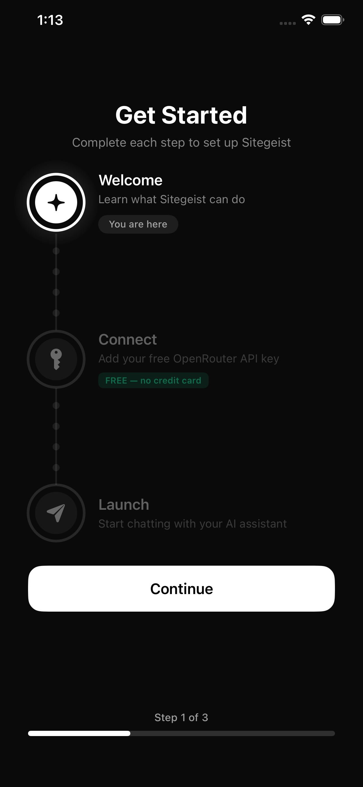
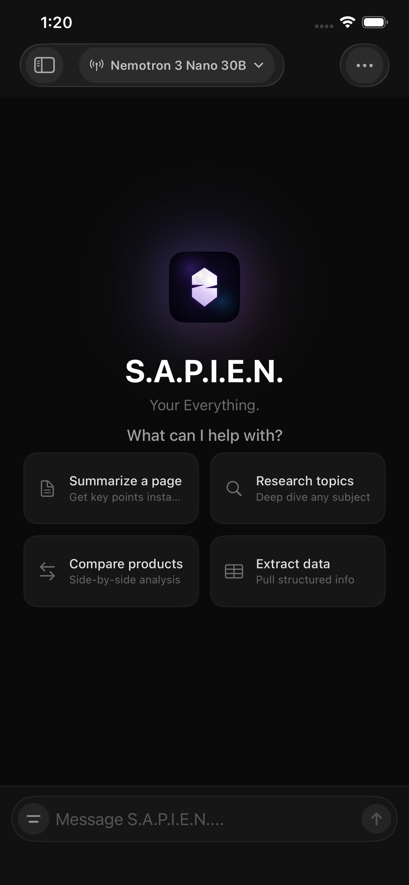
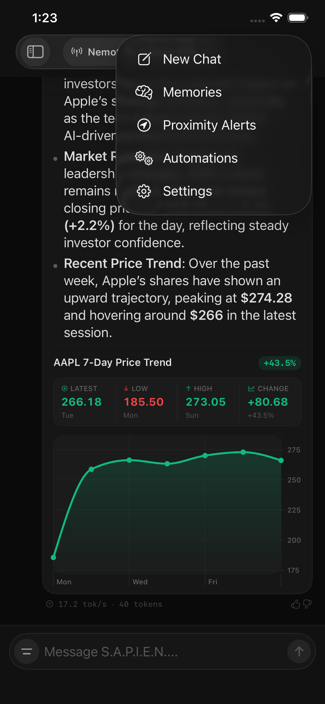
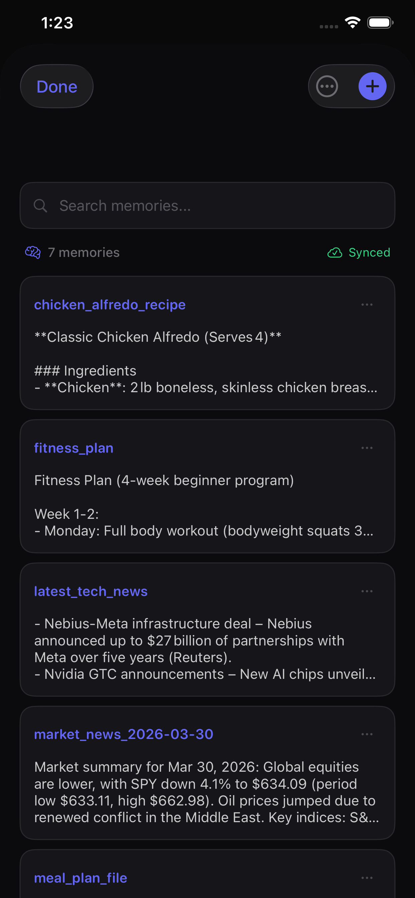
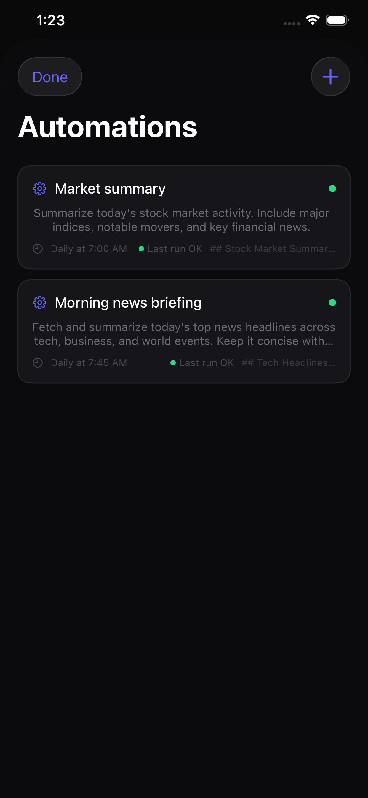
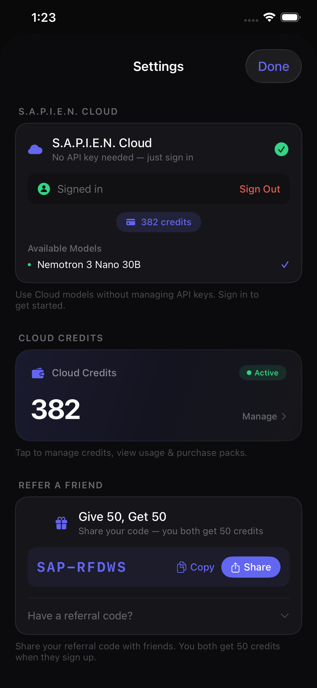
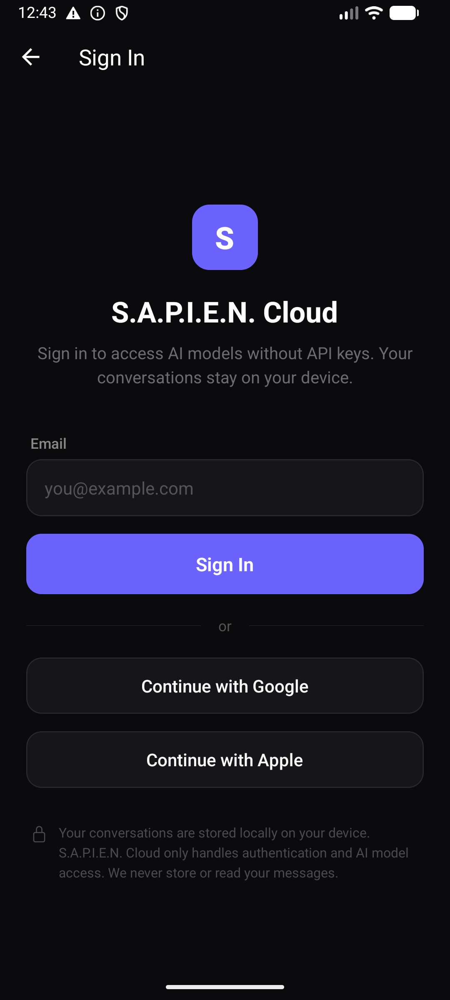
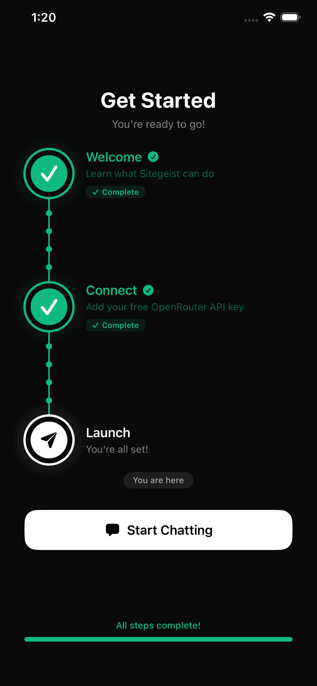

<div align="center">

# ◆ S.A.P.I.E.N.

### Your Everything.

One AI agent that remembers, sees, automates, and acts.
**Not a chatbot — a companion.**

[](https://devvgwardo.github.io/sapient-features/)
[](https://github.com/DevvGwardo/sapient-features)

<br />



<br /><br />

</div>

---

## ✨ Features

| | |
|:---|:---|
| 🧠 **47 AI Models** | Switch between GPT-4o, Claude, Gemini, Nemotron, Llama 3, Mistral, and 41 more — mid-conversation. S.A.P.I.E.N. picks the right one, or you choose. |
| 🌐 **Agentic Browsing** | Doesn't just fetch pages — it reads, understands, and acts on web content. Search, click, extract. Full browser automation with vision. |
| 💾 **Persistent Memory** | Builds a living knowledge graph of everything you tell it. Your preferences, context, and projects — remembered across sessions. |
| ⚡ **Automations** | Create workflows in plain English. *"Remind me to take meds every morning at 8am"* — scheduled and runs forever. |
| 📱 **Multi-Device** | Phone, desktop, watch, voice — syncs across all your devices. Start on your phone, finish on your laptop. |

---

## 🖼️ Screenshots

<div align="center">

| AI Chat | AI Browser |
|:---:|:---:|
|  |  |

| Memories | Automations |
|:---:|:---:|
|  |  |

| Onboarding | Settings |
|:---:|:---:|
|  |  |

| Sign In | Complete |
|:---:|:---:|
|  |  |

</div>

---

## 🌐 Live Site

The features page is deployed on GitHub Pages:

**👉 [devvgwardo.github.io/sapient-features](https://devvgwardo.github.io/sapient-features/)**

### Site Highlights

- **Parallax scrolling** — multi-layer depth effects on scroll with 3D tilt on hover
- **Cinematic animations** — staggered reveals, floating orbs, animated counters
- **Premium typography** — [Syne](https://fonts.google.com/specimen/Syne) display + [DM Sans](https://fonts.google.com/specimen/DM+Sans) body
- **Responsive** — 4 breakpoints (desktop → tablet → phone → SE) with hamburger menu
- **Accessible** — skip-nav link, `<main>` landmark, focus trap, ARIA labels, `prefers-reduced-motion`
- **Zero dependencies** — pure HTML, CSS, and vanilla JS. No build step.

---

## 🚀 Getting Started

### Local Development

```bash
# Clone the repo
git clone https://github.com/DevvGwardo/sapient-features.git
cd sapient-features

# Serve locally (any static server works)
python3 -m http.server 8000
# Open http://localhost:8000
```

### Deploy

The site deploys automatically via **GitHub Pages** from the `main` branch. Push to `main` and your changes go live.

---

## 📁 Project Structure

```
sapient-features/
├── index.html          # Single-file landing page (HTML + CSS + JS)
├── assets/
│   ├── ai-browser.png  # AI browsing screenshot
│   ├── ai-chat.png     # AI chat interface screenshot
│   ├── automations.png # Automations screen screenshot
│   ├── memories.png    # Memories screen screenshot
│   ├── onboarding-complete.png
│   ├── onboarding-welcome.png
│   ├── settings.png    # Cloud settings screenshot
│   └── sign-in.png     # Cloud sign-in screenshot
└── README.md
```

---

## 🛠 Tech Stack

| Layer | Technology |
|:---|:---|
| Markup | Semantic HTML5 |
| Styling | Custom CSS (no framework), CSS custom properties |
| Scripting | Vanilla JavaScript (ES2020+), Intersection Observer API |
| Fonts | [Syne](https://fonts.google.com/specimen/Syne) + [DM Sans](https://fonts.google.com/specimen/DM+Sans) via Google Fonts |
| Hosting | GitHub Pages |
| Build | None — zero dependencies |

---

## 🎨 Design System

The site uses a dark, cinematic design language:

| Token | Value | Usage |
|:---|:---|:---|
| `--bg` | `#050507` | Page background |
| `--fg` | `#eeeaef` | Primary text |
| `--accent` | `#8b5cf6` | Purple accent |
| `--accent-bright` | `#a78bfa` | Hover/active accent |
| `--amber` | `#f59e0b` | Warm highlights |
| `--green` | `#34d399` | Status indicators |

---

## 📱 Responsive Breakpoints

| Breakpoint | Target | Key Changes |
|:---|:---|:---|
| `> 900px` | Desktop | Full layout, parallax, mouse tilt |
| `≤ 900px` | Tablet | Single-column, hamburger menu, reduced parallax |
| `≤ 600px` | Phone | Compact spacing, 2×2 stats grid |
| `≤ 380px` | SE / Tiny | Minimum sizing, tighter padding |

---

## ♿ Accessibility

- Skip-to-content link
- `<main>` landmark region
- ARIA labels on navigation and dialogs
- Focus-visible outlines on interactive elements
- Focus trap in mobile menu with Escape key support
- `prefers-reduced-motion` disables all animations

---

## 📄 License

© 2026 Sitegeist. All rights reserved.

---

<div align="center">

**[View Live Site](https://devvgwardo.github.io/sapient-features/) · [Report Bug](https://github.com/DevvGwardo/sapient-features/issues) · [Request Feature](https://github.com/DevvGwardo/sapient-features/issues)**

</div>
